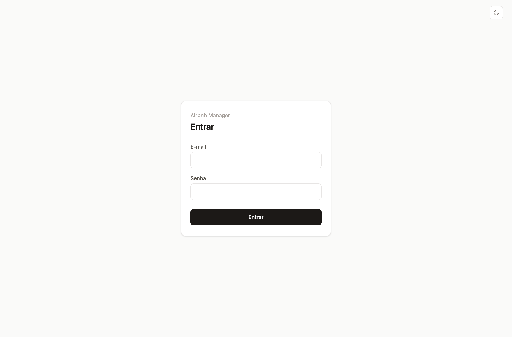
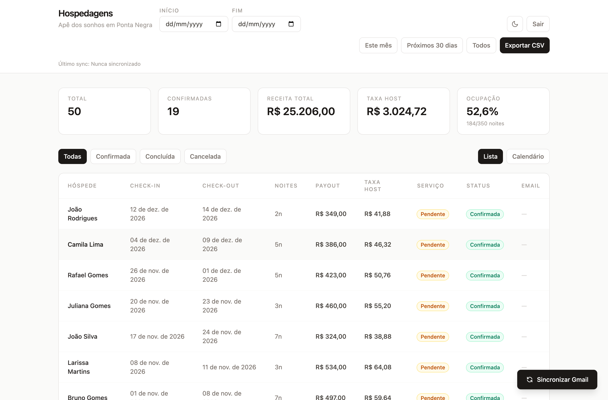
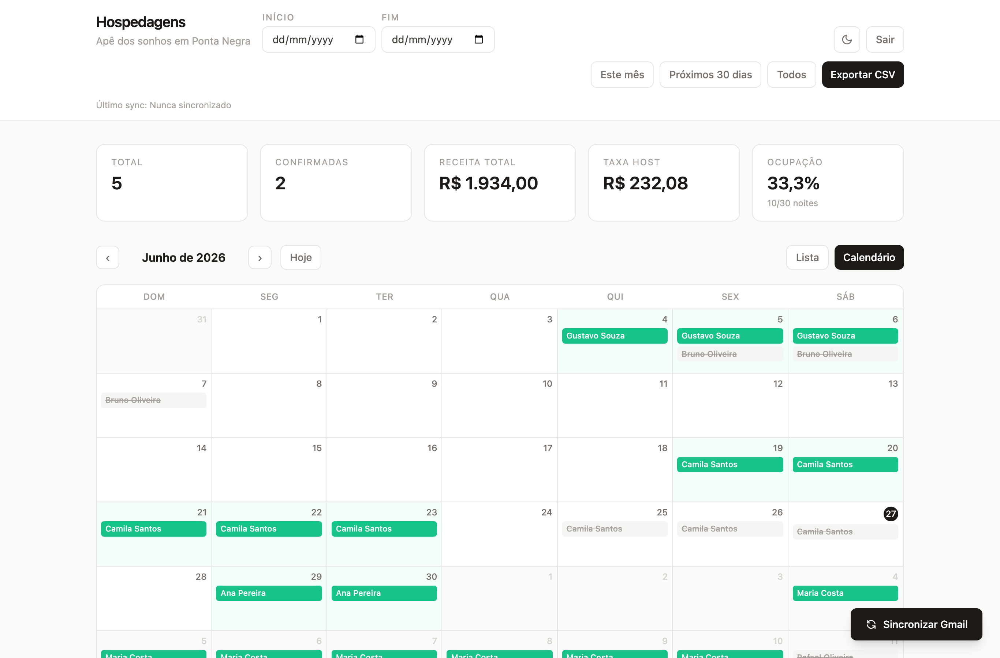
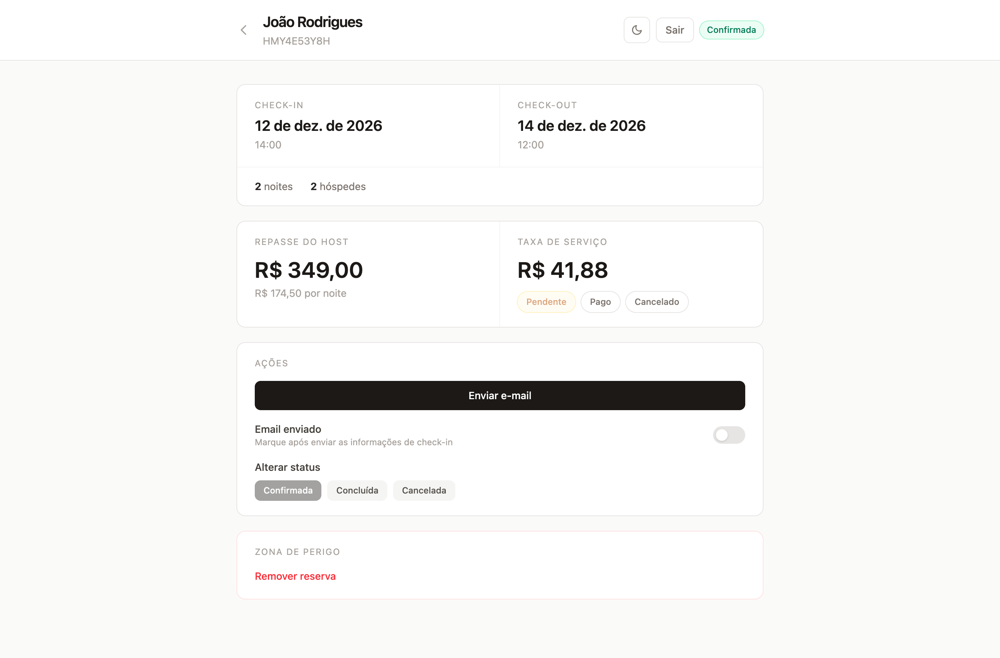

# Airbnb Manager

Painel de gestão de reservas de Airbnb que **importa automaticamente as reservas a partir dos e-mails do Gmail**, organiza tudo em um dashboard com tabela e calendário de ocupação, calcula estatísticas financeiras e **dispara e-mails de check-in automaticamente** para os hóspedes.

Construído como um monorepo com backend em **Node.js + Express + PostgreSQL** e frontend em **React + Vite + TypeScript**, seguindo princípios de Clean Architecture.

---

## Screenshots

| Login | Dashboard — Lista |
|-------|-------------------|
|  |  |

| Calendário de ocupação | Detalhe da reserva |
|------------------------|--------------------|
|  |  |

> As telas acima usam dados fictícios (nomes e valores anonimizados).

---

## Funcionalidades

- 🔄 **Sincronização com o Gmail** — lê os e-mails de confirmação do Airbnb via Gmail API e cria as reservas automaticamente (com deduplicação por ID de e-mail).
- 📊 **Dashboard com estatísticas** — total de reservas, confirmadas, receita total, taxa de host e taxa de ocupação.
- 📅 **Calendário de ocupação** — visualização mensal das reservas, com navegação entre meses.
- 📋 **Tabela de reservas** — com filtros por status (confirmada / concluída / cancelada), intervalo de datas e paginação.
- 🧾 **Detalhe da reserva** — datas, número de hóspedes, repasse do host, taxa de serviço e status de pagamento.
- ✉️ **E-mails de check-in automáticos** — cron diário que envia as informações de check-in para reservas próximas.
- 📤 **Exportação CSV** das reservas filtradas.
- 🌗 **Tema claro/escuro**.
- 🔐 **Autenticação via Firebase** (e-mail/senha), com rota de sincronização restrita a um e-mail autorizado.

---

## Stack

**Backend**
- Node.js + Express 5 (TypeScript)
- PostgreSQL + Knex (migrations)
- Firebase Admin SDK (verificação de token)
- Google APIs / Gmail API (importação de reservas)
- Nodemailer / Resend (envio de e-mails)
- node-cron (tarefas agendadas)

**Frontend**
- React 19 + Vite + TypeScript
- React Router 7
- Tailwind CSS 4
- Firebase Auth

---

## Arquitetura

O **frontend** segue uma separação por camadas (Clean Architecture):

```
frontend/src/
├── domain/          # entidades e regras de negócio puras
├── application/     # casos de uso / hooks (useReservations, useCalendar, useGmailSync...)
├── infrastructure/  # integrações externas (Firebase, HTTP, API)
└── presentation/    # páginas e componentes de UI
```

O **backend** segue uma organização em camadas por responsabilidade:

```
backend/src/
├── routes/          # definição das rotas Express
├── controllers/     # tratamento de request/response
├── services/        # regras de negócio, sync do Gmail, crons, e-mails
├── repositories/    # acesso a dados (Knex)
├── middlewares/     # auth Firebase + verificação de e-mail autorizado
└── migrations/      # versionamento do schema do banco
```

---

## Como rodar localmente

### Pré-requisitos
- Node.js 20+
- Docker (para o PostgreSQL) ou um Postgres local
- Um projeto no Firebase (Authentication habilitado)
- Credenciais OAuth do Google Cloud com a Gmail API habilitada (opcional, só para a sincronização)

### 1. Banco de dados

```bash
docker compose up -d        # sobe um PostgreSQL na porta 5432
```

### 2. Backend

```bash
cd backend
cp .env.example .env         # preencha as variáveis (veja abaixo)
npm install
npm run migrate:latest       # aplica as migrations
npm run dev                  # inicia em http://localhost:3000
```

Principais variáveis do `backend/.env`:

| Variável | Descrição |
|----------|-----------|
| `DATABASE_URL` | String de conexão do PostgreSQL |
| `FRONTEND_URL` | URL do frontend (para CORS e redirects do OAuth) |
| `SYNC_ALLOWED_EMAIL` | E-mail autorizado a executar a sincronização |
| `FIREBASE_PROJECT_ID` / `FIREBASE_CLIENT_EMAIL` / `FIREBASE_PRIVATE_KEY` | Service account do Firebase Admin |
| `GOOGLE_CLIENT_ID` / `GOOGLE_CLIENT_SECRET` / `GOOGLE_REDIRECT_URI` | Credenciais OAuth para a Gmail API |
| `GOOGLE_TOKEN_PATH` | Caminho onde o token do Google é persistido |
| `SMTP_*` / `RESEND_API_KEY` | Configuração de envio de e-mails |

### 3. Frontend

```bash
cd frontend
cp .env.example .env         # preencha as variáveis do Firebase Web
npm install
npm run dev                  # inicia em http://localhost:5173
```

Variáveis do `frontend/.env`:

| Variável | Descrição |
|----------|-----------|
| `VITE_API_URL` | URL do backend |
| `VITE_FIREBASE_API_KEY` / `VITE_FIREBASE_AUTH_DOMAIN` / `VITE_FIREBASE_PROJECT_ID` / `VITE_FIREBASE_APP_ID` | Config do Firebase Web |
| `VITE_SYNC_ALLOWED_EMAIL` | E-mail autorizado a ver o botão de sincronização |

---

## API

Todas as rotas de reservas exigem um token Firebase válido (`Authorization: Bearer <token>`). As rotas de `sync` e `admin` exigem, além disso, que o usuário seja o e-mail autorizado.

| Método | Rota | Descrição |
|--------|------|-----------|
| `GET` | `/health` | Health check |
| `GET` | `/reservations` | Lista reservas (filtros: `from`, `to`, `status`) |
| `GET` | `/reservations/export` | Exporta as reservas em CSV |
| `GET` | `/reservations/occupancy` | Estatísticas de ocupação |
| `GET` | `/reservations/calendar` | Dados para o calendário |
| `GET` | `/reservations/:id` | Detalhe de uma reserva |
| `POST` | `/reservations` | Cria uma reserva |
| `PATCH` | `/reservations/:id` | Atualiza uma reserva |
| `DELETE` | `/reservations/:id` | Remove uma reserva |
| `POST` | `/reservations/:id/send-email` | Envia o e-mail de check-in |
| `GET` / `POST` | `/sync` | Status / execução manual da sincronização do Gmail |
| `POST` | `/google-auth/start` | Inicia o fluxo OAuth do Google |
| `GET` | `/google-auth/callback` | Callback do OAuth do Google |
| `POST` | `/admin/checkin-emails/trigger` | Dispara manualmente o envio dos e-mails de check-in |

---

## Tarefas agendadas (cron)

- **Sincronização do Gmail** — busca novos e-mails de reserva periodicamente.
- **E-mails de check-in** — diariamente às 08:00, envia as informações de check-in para reservas confirmadas com check-in próximo que ainda não foram notificadas.

---

## Testes

```bash
cd backend
npm test
```
